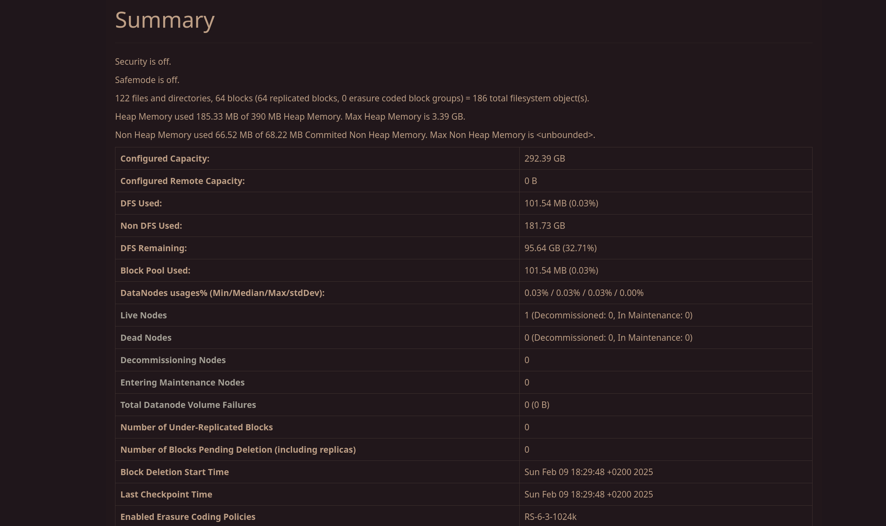
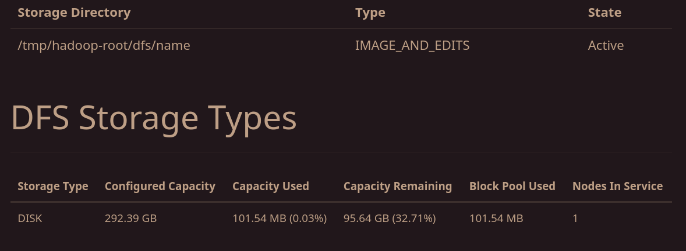
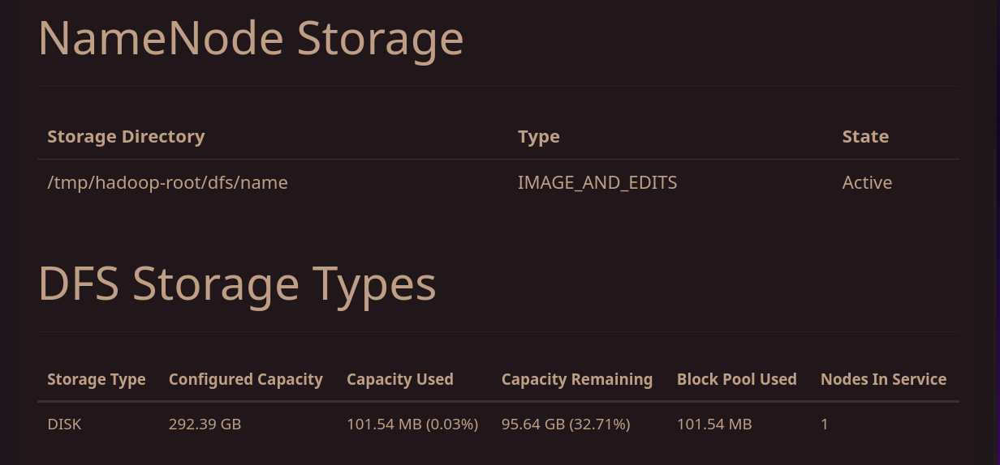
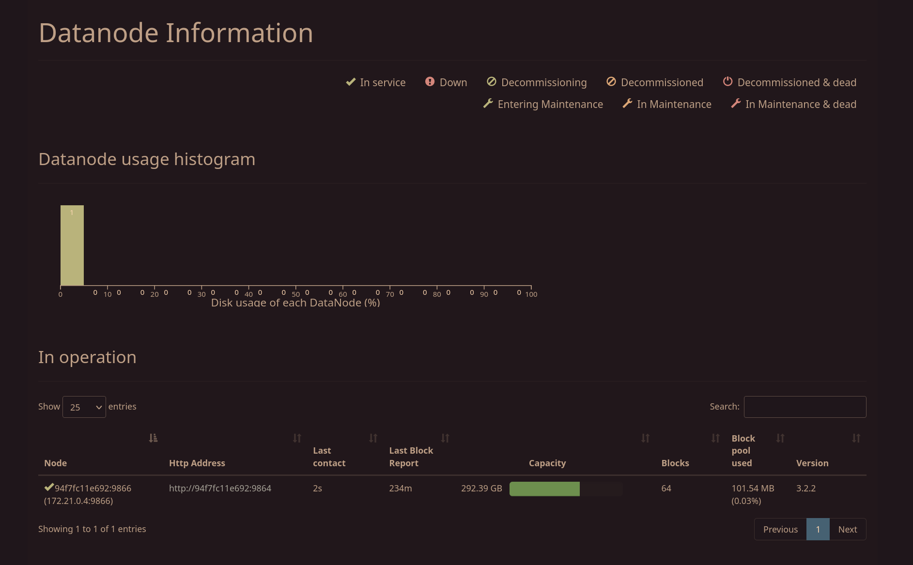

This script uploads CSV, Parquet, and Avro files for Dimension and TransferFact tables to HDFS directories. It ensures necessary directories exist, uploads files, and verifies the upload.

### Key Features
- **Directory Creation**: Ensures required HDFS directories are created.
- **File Upload**: Uploads CSV, Parquet, and Avro files to HDFS.
- **Verification**: Verifies successful upload by checking file presence in HDFS directories.

### Usage

1. **Ensure the Script Is Executable**  
   Make the script executable on your host:
   ```bash
   chmod +x /home/codsalah/Documents/git_repos/Hive-Based_TransferMarket_Data_Modeling-1/DataSchema/upload_to_hdfs.sh
   ```

2. **Run the Script Inside the Docker Container**  
   Use `docker exec` to run the script inside the namenode container:
   ```bash
   docker exec -it <docker-image-id> bash -c "HiveDWHExploration/LoadDataToHDFS/uploadToHDFS.sh"
   ```
   This runs the script inside the container with the mounted directory (`/home/codsalah/Documents/git_repos/Hive-Based_TransferMarket_Data_Modeling-1/DataSchema` mapped to `/data`).

### Requirements
- Hadoop and HDFS setup
- Docker environment with the namenode container
- Proper file permissions to access and upload to HDFS

### Example

```bash
# Make script executable
chmod +x /home/codsalah/Documents/git_repos/Hive-Based_TransferMarket_Data_Modeling-1/DataSchema/upload_to_hdfs.sh

# Run script inside Docker container
docker exec -it <docker-image-id> bash -c "HiveDWHExploration/LoadDataToHDFS/uploadToHDFS.sh"
```

### Final Output
The script logs:
- Directory creation status
- File upload status
- Upload verification results

## Loaded data and summarization of HDFS








---

**Author**: Salah