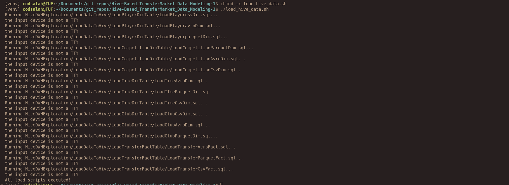
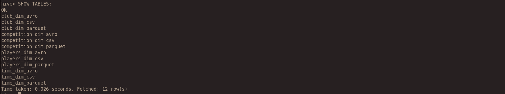
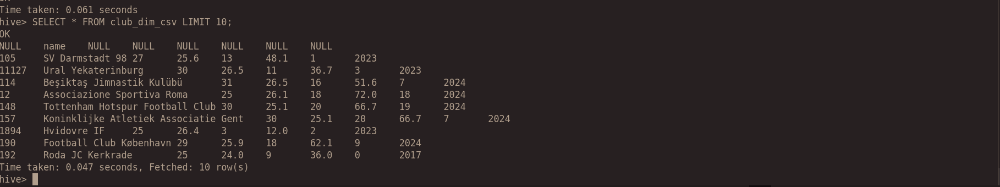
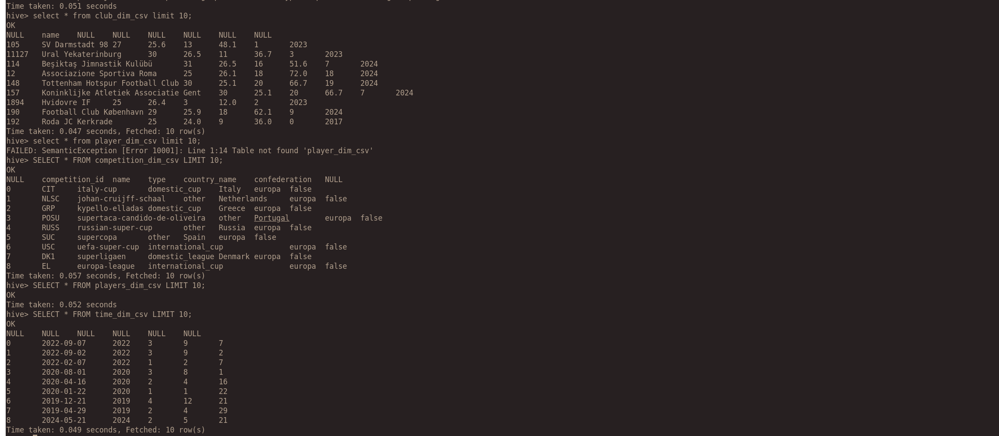

# LoadDataToHive  

This directory contains SQL scripts for loading data into **Hive** tables for the **Transfer Market Data Model**.  

## 📌 Directory Structure  

```
LoadDataToHive/
│── LoadClubDimTable/
│── LoadCompetitionDimTable/
│── LoadPlayerDimTable/
│── LoadTimeDimTable/
│── LoadTransferFactTable/
│── readme.md
```

## 🚀 How to Use  

### 1️⃣ **Start HiveServer2**  
Ensure HiveServer2 is running:  
```bash
docker exec -it presto-setup_hive_1 hive --service hiveserver2
```
Check if it's started:  
```bash
docker logs presto-setup_hive_1 | grep "Started HiveServer2"
```

### 2️⃣ **Run the Load Script**  
Execute the script to load data into Hive tables:  
```bash
./load_hive_data.sh
```




### 3️⃣ **Verify Data in Hive**  
Log into the Hive shell and check tables:  
```bash
hive
SHOW TABLES;
SELECT * FROM <table_name> LIMIT 10;
```





---

**Authors**: Salah, Shahd