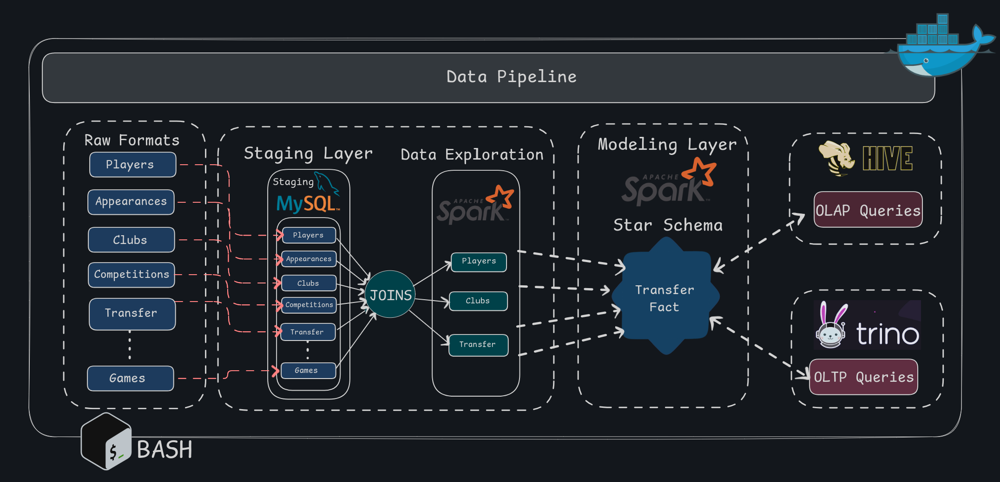

# Hive-Spark-Trino Data Pipeline for OLAP & OLTP

## Introduction
This project aims to build a **Data Warehouse (DWH)** that supports **Online Analytical Processing (OLAP) using Hive** and **Online Transaction Processing (OLTP) using Trino**. The system automatically and simultaneously processes both workloads to efficiently answer business queries using modern big data technologies.

## Data Flow & Architecture



The data flow follows these key stages:
1. **Data Ingestion**: Data arrives in multiple formats (CSV, Parquet, Avro).
2. **Staging Layer**: Raw data is first loaded into MySQL.
3. **Data Exploration**: Apache Spark is used for simple queries and data quality checks.
4. **Data Modeling**: Spark processes and transforms the data into the required structure.
5. **Storage in HDFS**: The transformed data is stored in **HDFS**.
6. **Querying**:
   - **Hive for OLAP**: Used for analytical processing from HDFS.
   - **Trino for OLTP**: Used for transactional queries from HDFS.


## Technologies Used
- **Apache Spark** – Data exploration and modeling
- **HDFS (Hadoop Distributed File System)** – Distributed storage
- **Apache Hive** – OLAP querying
- **Trino** – OLTP querying
- **Docker** – Containerization for deployment
- **Bash** – Automation scripts
- **MySQL** – Staging layer for initial data storage

## Setup & Installation
To run this project, ensure you have the following dependencies installed:

### Data Updated Resource
[TransferMarket Dataset on Kaggle](https://www.kaggle.com/datasets/davidcariboo/player-scores)

### DWH Star Schema
[Data Schema](./DataSchema)

### Prerequisites
- **Docker** 
- **Apache Spark** 
- **Hadoop & HDFS** 
- **Apache Hive**
- **Trino**
- **MySQL**
- **Bash scripting support**

### Installation Steps
1. Clone the repository:
   ```bash
   git clone https://github.com/codsalah/Hive-Spark-Trino-Data-Pipeline-for-OLAP-OLTP
   cd Hive-Spark-Trino-Data-Pipeline-for-OLAP-OLTP/
   ```
2. Start the necessary services using Docker:
   ```bash
   docker-compose up -d
   ```
3. Load initial data into MySQL staging:
   ```bash
   bash scripts/load_hive_data.sh
   ```
4. Verify the data in Hive and Trino:
   ```sql
   SELECT * FROM hive_database.table_name;
   SELECT * FROM trino_database.table_name;
   ```

## Usage & Workflow
- Load raw data into MySQL staging.
- Use Spark to explore and process the data.
- Store processed data in HDFS.
- Query data using Hive for analytical workloads.
- Query data using Trino for transactional workloads.

## Contributors
- [@codsalah](https://github.com/codsalah) Salah Algamasy
- [@shahdhamdi](https://github.com/shahdhamdi) Shahd Hamdi
- [@salma-nour-eldeen6](https://github.com/salma-nour-eldeen6) Salma Nour-Eldeen
