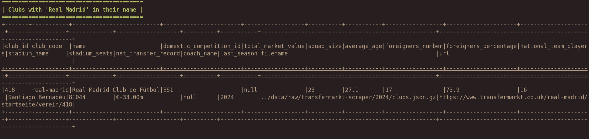
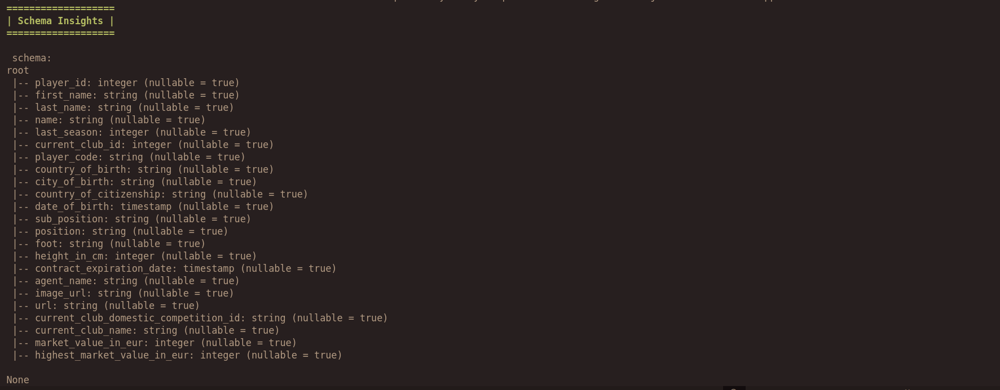
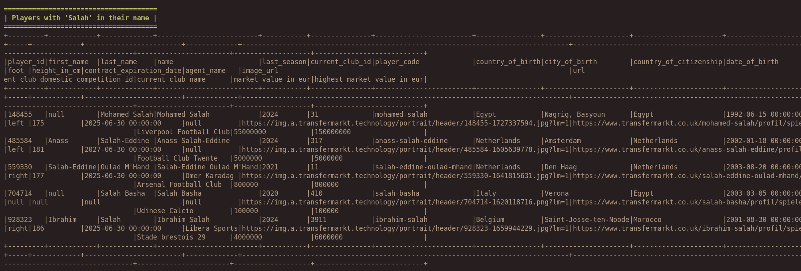
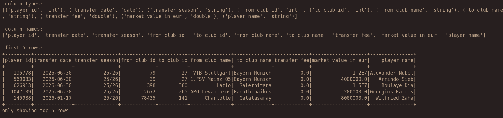

# Spark Data Exploration  

This folder contains scripts for exploring and analyzing data using Apache Spark.  

### Files:  
- **ClubsInsights.py** – Analyzes club-related data.  
- **PlayersInsights.py** – Explores player statistics and details.  
- **TransferInsights.py** – Provides insights into player transfers.  
- **ParquetCheck.py** – Checks and verifies Parquet file contents.  
- **utils.py** – Contains helper functions for Spark session creation, file reading, and saving data in multiple formats (CSV, Parquet, Avro).  

### Usage:  
These scripts help extract meaningful insights from datasets by leveraging Spark's data processing capabilities.

# Club Insights 📊

# Players Insights 📊

# Transfer Insights 📊

---

**Author**: Salah 
